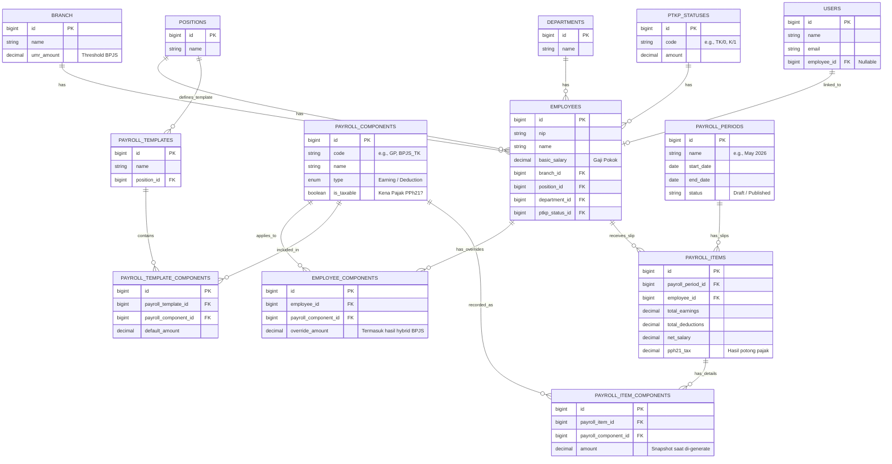

# Entity Relationship Diagram (ERD) - Sobat Gaji

Dokumen ini memetakan relasi antar entitas (tabel) di dalam database sistem penggajian Sobat Gaji. Diagram ini sangat penting sebagai referensi utama apabila Anda ingin melakukan migrasi database atau migrasi backend ke bahasa pemrograman lain (seperti Golang).

## Mengapa ERD Ini Penting untuk Migrasi Golang?
1. **Model Generasi:** Di Golang (menggunakan GORM, Ent, atau SQLx), Anda harus mendefinisikan *structs* yang persis mewakili entitas ini.
2. **Ketergantungan Foreign Key:** Diagram ini menunjukkan urutan migrasi. Anda harus memigrasi tabel `branch` dan `ptkp_statuses` sebelum memigrasi data `employees`.
3. **Snapshot Transaksi:** Tabel `payroll_items` dan `payroll_item_components` adalah tabel statis historis. Jika logika *Generate Payroll* di-*rewrite* di Golang, output kalkulasinya wajib mengikuti skema ini agar riwayat slip gaji lama tidak rusak.
